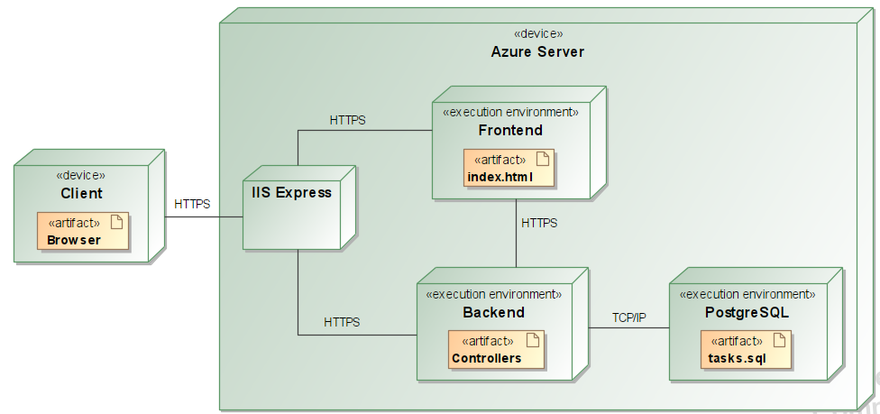

INFORMATIKOS FAKULTETAS

**T120B165 Saityno taikomųjų programų projektavimas**

**Projekto „Darbuotojų valdymo sistema“ ataskaita**

Studentas: Tadas Jutkus, IFF - 0/6

Dėstytojai: Tomas Blažauskas

KAUNAS 2023

**Turinys**

[**1. Sprendžiamo uždavinio aprašymas 3**](#sprendžiamo-uždavinio-aprašymas)

[**1.1. Sistemos paskirtis 3**](#sistemos-paskirtis)

[**1.2. Funkciniai reikalavimai 3**](#funkciniai-reikalavimai)

[**2. Sistemos architektūra 4**](#sistemos-architektūra)

# Sprendžiamo uždavinio aprašymas

## Sistemos paskirtis

Projekto tikslas – palengvinti darbdavio užduočių priskyrimą ir jų atlikimo sekimą darbuotojams.

Darbdavys galės sistemoje sukurti darbuotojų paskyras, jiems suteikti prisijungimus prie sistemos. Darbuotojai prisijungę galės matyti kokius projektus jie turi ir kokias užduotis tuose projektuose reikės atlikti.

## Funkciniai reikalavimai

Neregistruotas sistemos naudotojas galės:

1.  Peržiūrėti pagrindinį puslapį (Landing page).
2.  Prisijungti kaip darbuotojas/darbdavys.

    Darbuotojas galės:

3.  Atsijungti nuo sistemos.
4.  Matyti priskirtus projektus.
5.  Matyti projekte esamas užduotis
6.  Keisti užduočių būseną.

Darbdavys galės:

1.  Sukurti darbuotojo paskyrą.
2.  Ištrinti darbuotojo paskyrą.
3.  Redaguoti darbuotojo paskyrą.
4.  Sukurti projektą.
5.  Redaguoti projektą.
6.  Priskirti projektą darbuotojui.
7.  Ištrinti projektą.
8.  Sukurti užduotį projekte.
9.  Ištrinti užduotį.
10. Redaguoti užduotį.
11. Matyti darbuotojų sąrašą.

# Sistemos architektūra

Sistemos sudedamosios dalys:

-   Kliento pusė (ang. Front-End) – naudojant React.js;
-   Serverio pusė (angl. Back-End) – naudojant C\# ASP .NET Core, Duomenų bazė - PostgreSQL.

2.1 pav. pavaizduota sistemos diegimo diagrama. Naudotojas, pasileidęs naršyklę, galės HTTPS protokolu pasiekti sistemą, patalpintą Azure serveryje. Sistemos veikimui naudojamas API, kuris komunikuoja su duomenų baze per ORM (Entity Framework).

**2.1 pav.** sistemos diegimo diagrama
