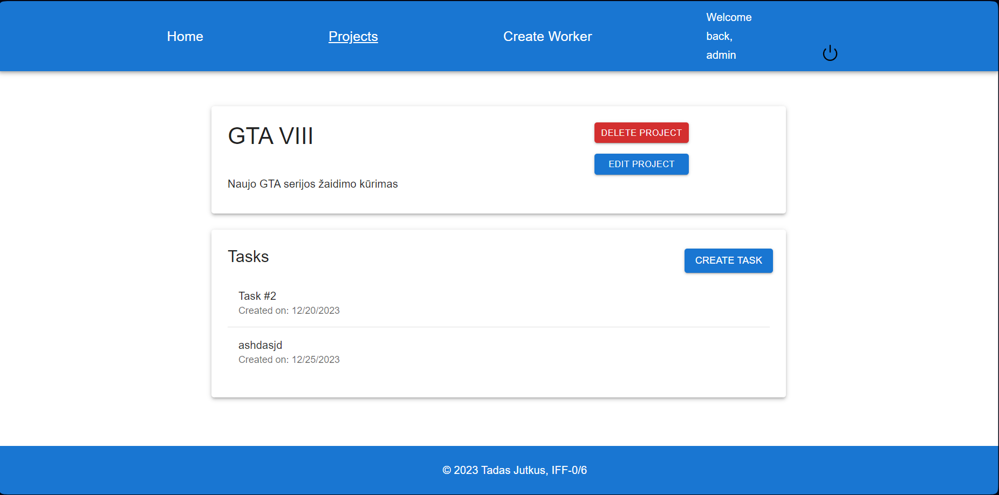

INFORMATIKOS FAKULTETAS

**T120B165 Saityno taikomųjų programų projektavimas**

**Projekto „Darbuotojų valdymo sistema“ ataskaita**

Studentas: Tadas Jutkus, IFF - 0/6

Dėstytojai: Tomas Blažauskas

KAUNAS 2023

**Turinys**

[**1. Sprendžiamo uždavinio aprašymas 3**](#sprendžiamo-uždavinio-aprašymas)

[**1.1. Sistemos paskirtis 3**](#sistemos-paskirtis)

[**1.2. Funkciniai reikalavimai 3**](#funkciniai-reikalavimai)

[**2. Sistemos architektūra 4**](#sistemos-architektūra)

[**3. Sistemos struktūra 4**](#3-sistemos-struktūra)

[**4. API specifikacija 5**](#4-api-specifikacija)

[**5. Sistemos naudotojo sąsaja 14**](#5-sistemos-naudotojo-sąsaja)

# Sprendžiamo uždavinio aprašymas

## Sistemos paskirtis

Projekto tikslas – palengvinti darbdavio užduočių priskyrimą ir jų atlikimo sekimą darbuotojams.

Darbdavys galės sistemoje sukurti darbuotojų paskyras, jiems suteikti prisijungimus prie sistemos. Darbuotojai prisijungę galės matyti kokius projektus jie turi ir kokias užduotis tuose projektuose reikės atlikti.

## Funkciniai reikalavimai

Neregistruotas sistemos naudotojas galės:

1.  Peržiūrėti pagrindinį puslapį (Landing page).
2.  Prisijungti kaip darbuotojas/darbdavys.

    Darbuotojas galės:

3.  Atsijungti nuo sistemos.
4.  Matyti priskirtus projektus.
5.  Matyti projekte esamas užduotis
6.  Keisti užduočių būseną.

Darbdavys galės:

1.  Sukurti darbuotojo paskyrą.
2.  Ištrinti darbuotojo paskyrą.
3.  Redaguoti darbuotojo paskyrą.
4.  Sukurti projektą.
5.  Redaguoti projektą.
6.  Priskirti projektą darbuotojui.
7.  Ištrinti projektą.
8.  Sukurti užduotį projekte.
9.  Ištrinti užduotį.
10. Redaguoti užduotį.
11. Matyti darbuotojų sąrašą.

# Sistemos architektūra

Sistemos sudedamosios dalys:

-   Kliento pusė (ang. Front-End) – naudojant React.js;
-   Serverio pusė (angl. Back-End) – naudojant C\# ASP .NET Core, Duomenų bazė - PostgreSQL.

2.1 pav. pavaizduota sistemos diegimo diagrama. Naudotojas, pasileidęs naršyklę, galės HTTPS protokolu pasiekti sistemą, patalpintą Azure serveryje. Sistemos veikimui naudojamas API, kuris komunikuoja su duomenų baze per ORM (Entity Framework).

**2.1 pav.** sistemos diegimo diagrama

# 3. Sistemos struktūra

Serverio pusė sudaryta iš šių kontrolerių:

-   ProjectEndpoints.cs - atsakingas už projektų CRUD ir kitas operacijas
-   TaskEndpoints.cs - atsakingas už užduočių priklausančių projektui CRUD operacijas.
-   WorkerEndpoints.cs - atsakingas už darbuotojų priklausančių užduočiai CRUD operacijas.

# 4. API specifikacija

| API metodas         | GetProjects                                                                                          |
|---------------------|------------------------------------------------------------------------------------------------------|
| Paskirtis           | Gauti visų projektų sąrašą                                                                           |
| Kelias iki metodo   | api/projects                                                                                         |
| Užklausos struktūra | -                                                                                                    |
| Header dalis        | Authorization: Bearer {token}                                                                        |
| Atsakymo struktūra  | [{ “projectId”: “...”, “name”: “...”, “description”:”...” }, { “projectId”:”...”, “name”:”...”, … }] |
| Atsakymo kodas      | Ok(200)                                                                                              |
| Galimi klaidų kodai | 401 – jei siunčiamas autorizacijos JWT žetonas yra neteisingas.                                      |

lentelė 1. Projektų gavimo API

| API metodas         | GetProject                                                                          |
|---------------------|-------------------------------------------------------------------------------------|
| Paskirtis           | Gauti vieno projektą                                                                |
| Kelias iki metodo   | api/projects/{projectID}                                                            |
| Užklausos struktūra | -                                                                                   |
| Header dalis        | Authorization: Bearer {token}                                                       |
| Atsakymo struktūra  | [{ “projectId”: “...”, “name”:”...”, “description”:”...” }]                         |
| Atsakymo kodas      | Ok(200)                                                                             |
| Galimi klaidų kodai | 401 – jei siunčiamas autorizacijos JWT žetonas yra neteisingas. 404 - jei nerastas. |

lentelė 2. Projekto gavimo API

| API metodas         | CreateProject                                                                                    |
|---------------------|--------------------------------------------------------------------------------------------------|
| Paskirtis           | Sukurti projektą                                                                                 |
| Kelias iki metodo   | api/projects                                                                                     |
| Užklausos struktūra | [{ “name”:”...”, “description”:”...” }]                                                          |
| Header dalis        | Authorization: Bearer {token}                                                                    |
| Atsakymo struktūra  | [{ “projectId”: “...”, “name”:”...”, “description”:”...” }]                                      |
| Atsakymo kodas      | Created(201)                                                                                     |
| Galimi klaidų kodai | 401 – jei siunčiamas autorizacijos JWT žetonas yra neteisingas. 422- jei neatitinka validacijos. |

lentelė 3. Projektų kūrimo API

| API metodas         | UpdateProject                                                                                                        |
|---------------------|----------------------------------------------------------------------------------------------------------------------|
| Paskirtis           | Redaguoti sukurtą projektą                                                                                           |
| Kelias iki metodo   | api/projects/{projectId}                                                                                             |
| Užklausos struktūra | [{ “description”:”...” }]                                                                                            |
| Header dalis        | Authorization: Bearer {token}                                                                                        |
| Atsakymo struktūra  | -                                                                                                                    |
| Atsakymo kodas      | Ok(200)                                                                                                              |
| Galimi klaidų kodai | 401 – jei siunčiamas autorizacijos JWT žetonas yra neteisingas. 422- jei neatitinka validacijos. 404 - jei nerastas. |

lentelė 4. Projektų redagavimo API

| API metodas         | DeleteProject                                                                       |
|---------------------|-------------------------------------------------------------------------------------|
| Paskirtis           | Ištrinti projektą                                                                   |
| Kelias iki metodo   | api/projects/{projectId}                                                            |
| Užklausos struktūra | -                                                                                   |
| Header dalis        | Authorization: Bearer {token}                                                       |
| Atsakymo struktūra  | -                                                                                   |
| Atsakymo kodas      | Ok(200)                                                                             |
| Galimi klaidų kodai | 401 – jei siunčiamas autorizacijos JWT žetonas yra neteisingas. 404 - jei nerastas. |

lentelė 5. Projektų trynimo API

| API metodas         | GetTasks                                                                                       |
|---------------------|------------------------------------------------------------------------------------------------|
| Paskirtis           | Gauti visų užduočių sąrašą                                                                     |
| Kelias iki metodo   | api/projects/{projectId}/tasks                                                                 |
| Užklausos struktūra | -                                                                                              |
| Header dalis        | Authorization: Bearer {token}                                                                  |
| Atsakymo struktūra  | [{ “taskId”: “...”, “name”: “...”, “description”:”...” }, { “taskId”:”...”, “name”:”...”, … }] |
| Atsakymo kodas      | Ok(200)                                                                                        |
| Galimi klaidų kodai | 401 – jei siunčiamas autorizacijos JWT žetonas yra neteisingas.                                |

lentelė 6. Užduočių gavimo API

| API metodas         | GetTask                                                                             |
|---------------------|-------------------------------------------------------------------------------------|
| Paskirtis           | Gauti vieno užduotį                                                                 |
| Kelias iki metodo   | api/projects/{projectID}/tasks/{taskId}                                             |
| Užklausos struktūra | -                                                                                   |
| Header dalis        | Authorization: Bearer {token}                                                       |
| Atsakymo struktūra  | [{ “taskId”: “...”, “name”:”...”, “description”:”...” }]                            |
| Atsakymo kodas      | Ok(200)                                                                             |
| Galimi klaidų kodai | 401 – jei siunčiamas autorizacijos JWT žetonas yra neteisingas. 404 - jei nerastas. |

lentelė 7. Užduoties gavimo API

| API metodas         | CreateTask                                                                                       |
|---------------------|--------------------------------------------------------------------------------------------------|
| Paskirtis           | Sukurti užduotį                                                                                  |
| Kelias iki metodo   | api/projects/{projectId}/tasks                                                                   |
| Užklausos struktūra | [{ “name”:”...”, “description”:”...” }]                                                          |
| Header dalis        | Authorization: Bearer {token}                                                                    |
| Atsakymo struktūra  | [{ “taskId”: “...”, “name”:”...”, “description”:”...” }]                                         |
| Atsakymo kodas      | Created(201)                                                                                     |
| Galimi klaidų kodai | 401 – jei siunčiamas autorizacijos JWT žetonas yra neteisingas. 422- jei neatitinka validacijos. |

lentelė 8. Užduoties kūrimo API

| API metodas         | UpdateTask                                                                                                           |
|---------------------|----------------------------------------------------------------------------------------------------------------------|
| Paskirtis           | Redaguoti sukurtą projektą                                                                                           |
| Kelias iki metodo   | api/projects/{projectId}/tasks/{taskId}                                                                              |
| Užklausos struktūra | [{ “description”:”...” }]                                                                                            |
| Header dalis        | Authorization: Bearer {token}                                                                                        |
| Atsakymo struktūra  | -                                                                                                                    |
| Atsakymo kodas      | Ok(200)                                                                                                              |
| Galimi klaidų kodai | 401 – jei siunčiamas autorizacijos JWT žetonas yra neteisingas. 422- jei neatitinka validacijos. 404 - jei nerastas. |

lentelė 9. Užduoties redagavimo API

| API metodas         | DeleteTask                                                                          |
|---------------------|-------------------------------------------------------------------------------------|
| Paskirtis           | Ištrinti užduotį                                                                    |
| Kelias iki metodo   | api/projects/{projectId}/tasks/{taskId}                                             |
| Užklausos struktūra | -                                                                                   |
| Header dalis        | Authorization: Bearer {token}                                                       |
| Atsakymo struktūra  | -                                                                                   |
| Atsakymo kodas      | Ok(200)                                                                             |
| Galimi klaidų kodai | 401 – jei siunčiamas autorizacijos JWT žetonas yra neteisingas. 404 - jei nerastas. |

lentelė 10. Užduoties trynimo API

| API metodas         | GetWrokers                                                                                                                                                                 |
|---------------------|----------------------------------------------------------------------------------------------------------------------------------------------------------------------------|
| Paskirtis           | Gauti visų darbuotojų sąrašas                                                                                                                                              |
| Kelias iki metodo   | api/projects/{projectId}/tasks/{taskId}/workers                                                                                                                            |
| Užklausos struktūra | -                                                                                                                                                                          |
| Header dalis        | Authorization: Bearer {token}                                                                                                                                              |
| Atsakymo struktūra  | [{ “workerId”: “...”, “Firstname”: “...”, “Lastname”: “...”, “Username”: “...”, “CreationDate”: “...”, }, { “workerId”: “...”, “Firstname”: “...”, “Lastname”: “...”, … }] |
| Atsakymo kodas      | Ok(200)                                                                                                                                                                    |
| Galimi klaidų kodai | 401 – jei siunčiamas autorizacijos JWT žetonas yra neteisingas.                                                                                                            |

lentelė 11. Darbuotojų gavimo API

| API metodas         | GetWorker                                                                                                 |
|---------------------|-----------------------------------------------------------------------------------------------------------|
| Paskirtis           | Gauti vieną darbuotoją                                                                                    |
| Kelias iki metodo   | api/projects/{projectId}/tasks/{taskId}/workers/{workerId}                                                |
| Užklausos struktūra | -                                                                                                         |
| Header dalis        | Authorization: Bearer {token}                                                                             |
| Atsakymo struktūra  | [{ “workerId”: “...”, “Firstname”: “...”, “Lastname”: “...”, “Username”: “...”, “CreationDate”: “...”, }] |
| Atsakymo kodas      | Ok(200)                                                                                                   |
| Galimi klaidų kodai | 401 – jei siunčiamas autorizacijos JWT žetonas yra neteisingas. 404 - jei nerastas.                       |

lentelė 12. Darbuotojo gavimo API

| API metodas         | CreateWorker                                                                                              |
|---------------------|-----------------------------------------------------------------------------------------------------------|
| Paskirtis           | Sukurti darbuotoją                                                                                        |
| Kelias iki metodo   | api/projects/{projectId}/tasks/{taskId}/workers/{workerId}                                                |
| Užklausos struktūra | [{ “Firstname”: “...”, “Lastname”: “...”, “Username”: “...”, “Email”:”...”, “Password”:””... }]           |
| Header dalis        | Authorization: Bearer {token}                                                                             |
| Atsakymo struktūra  | [{ “workerId”: “...”, “Firstname”: “...”, “Lastname”: “...”, “Username”: “...”, “CreationDate”: “...”, }] |
| Atsakymo kodas      | Created(201)                                                                                              |
| Galimi klaidų kodai | 401 – jei siunčiamas autorizacijos JWT žetonas yra neteisingas. 422- jei neatitinka validacijos.          |

lentelė 13. Darbuotojo kūrimo API

| API metodas         | UpdateWorker                                                                                                         |
|---------------------|----------------------------------------------------------------------------------------------------------------------|
| Paskirtis           | Redaguoti sukurtą darbuotoją                                                                                         |
| Kelias iki metodo   | api/projects/{projectId}/tasks/{taskId}/workers/{workerId}                                                           |
| Užklausos struktūra | [{ “Firstname”: “...”, “Lastname”: “...”, “Username”: “...” }]                                                       |
| Header dalis        | Authorization: Bearer {token}                                                                                        |
| Atsakymo struktūra  | -                                                                                                                    |
| Atsakymo kodas      | Ok(200)                                                                                                              |
| Galimi klaidų kodai | 401 – jei siunčiamas autorizacijos JWT žetonas yra neteisingas. 422- jei neatitinka validacijos. 404 - jei nerastas. |

lentelė 14. Darbuotojo redagavimo API

| API metodas         | DeleteWorker                                                                        |
|---------------------|-------------------------------------------------------------------------------------|
| Paskirtis           | Ištrinti darbuotoją                                                                 |
| Kelias iki metodo   | api/projects/{projectId}/tasks/{taskId}/workers/{workerId}                          |
| Užklausos struktūra | -                                                                                   |
| Header dalis        | Authorization: Bearer {token}                                                       |
| Atsakymo struktūra  | -                                                                                   |
| Atsakymo kodas      | Ok(200)                                                                             |
| Galimi klaidų kodai | 401 – jei siunčiamas autorizacijos JWT žetonas yra neteisingas. 404 - jei nerastas. |

lentelė 15. Darbuotojo trynimo API

# 

# 5. Sistemos naudotojo sąsaja

pav 1. Neprisijungusio vartotojo langas

pav 2. Prisijungimo langas

pav 3. Pagrindinis langas prisijungus

pav 4. Projektų sąrašo langas

pav 5. Projektų kūrimo langas

pav 6. Projekto ir užduočių langas

pav 7. Projekto redagavimo langas

pav 8. Užduoties ir priskirtų darbuotojų langas

pav 9. Darbuotojų priskyrimo langas

pav 10. Darbuotojų kūrimo langas
